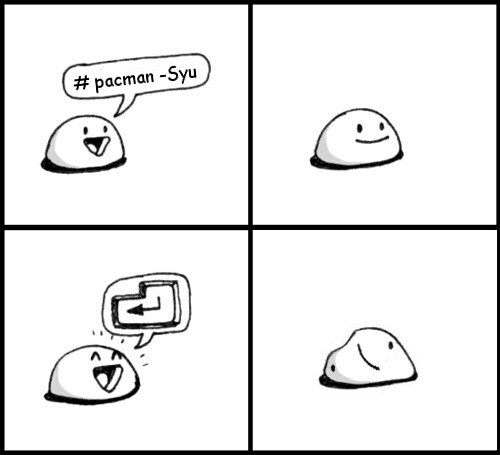
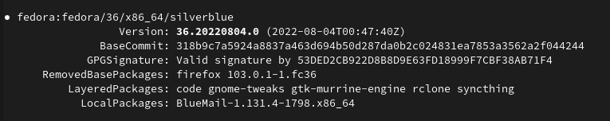

+++
template = "post.html"

[attributes]
title = "Fedora Silverblue: A Review"
date = 2022-08-04T20:00:00-04:00
summary = "I have seen the future, and it is immutable"
cover_image = "cover.jpg" 
tags = ["linux"]
+++

## Introduction

Not too long ago, I made the mistake of upgrading my desktop to Windows 11. Why, I cannot remember - but my perceived corporate loyalty was rewarded a few weeks later when an overnight system update completely trashed my filesystem. I woke up to a monochrome screen proclaiming a failure to boot, and an NTFS partition that wheezed corrupt data.

It was at this point I realized I was done with Windows. No data had been lost thanks to my cloud backups, but this inconvenient incident was the proverbial straw that broke the camel's back. The ever-encroaching ads, spyware and instability had all become too much for me to tolerate.

Fortunately, I had an easy escape hatch: Linux, an OS I'd been comfortably using - but never fully mainlining - for a little under a decade. So I knuckled down, did some research, and singled out EndeavourOS. As an Arch derivative, its flexibility and bleeding-edge nature seemed highly appealing to a customization addict like me.

This was a poor analysis on my part.

Oh, this isn't a hit piece on EndeavourOS. It delivered exactly what I wanted, and the honeymoon period was wonderful. I loved all the dials I could spin, I tried *four* different DEs, and I've never really been able to find something that matches the depth and convenience of the AUR.

Then it broke. Nvidia driver update, you see - DKMS lacerated itself on the cutting edge, and now X11 couldn't find any displays. My annoyed Googling revealed that this was not an uncommon occurrence with Nvidia drivers. Okay, fine, rollback - everything returns to normal, and I'll make sure to check the forums next time.

A month later, my Realtek WiFi adapter stopped working without warning after another update. After an hour digging around in my system's guts, scrubbing every trace of the driver and then reinstalling it, it started working again.

Another month went by, and suddenly my system refused to stay in sleep mode. I'd hit the power button, the PSU would go *click*... and then a few seconds later, *click* again as the machine roared back to life. By now I had well and truly soured on Arch, and struck out looking for alternatives. 

I landed on the venerable Fedora Workstation, which offered a measured balance between The New Hotness™ and the OS not spontaneously combusting every time I updated. And there I stayed... until I discovered Silverblue.

## System Rot

My fundamental problem with Arch-slash-EndeavourOS was simple: it was painfully prone to system rot. Racing along the bleeding edge certainly has its advantages, but it seems that moving at such a breakneck pace ultimately catches up to you. Perhaps a crucial library gets misplaced or malversioned, or a new version of something has a nasty bug that didn't get caught. With each run of `pacman -Syu`, your chances of something getting borked asymptotically approach one hundred percent. 

"Traditional" distros like Fedora and Ubuntu more or less avoid these problems by shielding their users from the bleeding edge, exerting some level of control over when newer package versions are available so they can be vetted for good behavior. But even here, rot creeps in through corner cases and simple entropy, insidiously worming its way deep into an installation until something snaps. The famous tale of the [500 mile email](https://www.ibiblio.org/harris/500milemail.html) can be seen as an example of this.

The net result is a massive headache. It becomes impossible to identify if a system is in a "known good" state, even under the most blasé of use cases. 

If Alice upgrades from A to B and experiences a breaking change, she can "roll back" - but then she won't be running A or B, but *C*, an unpredictable bastard cross existing in limbo between the well-behaved releases offered by upstream. Things get even worse when you run afoul of partial upgrades or simply hold onto an install for too long.

These, in a nutshell, are the problems Silverblue solves.

## Pristine, Forever

Perhaps best described as "Git for your OS," Silverblue (and its underlying driver `ostree`) distinguish themselves by replacing the traditional mutable root filesystem with an immutable image, the state of which is tracked (and diff-able!) much like a Git commit. 

By default, the system remembers the current "deployment" and its predecessor, but an arbitrary number of past and future deployments can be "pinned" and booted into at any time. It's even possible to rebase onto a different remote tree entirely, allowing you to near-seamlessly switch to alternate Silverblue spins like Kinoite (which offers KDE instead of GNOME) and back again.

*Most* of the directories in `/` are read-only on a Silverblue install; all runtime state is stored in `/var` (indeed, `/home` is a symlink to `/var/home`) and `/etc` is open for configuration purposes, but gone are the days of manually dropping program binaries into `/usr/bin`.

The point of all this is to ensure that your operating system is only mutated under controlled conditions where changes are atomically tracked. When you run an update or layer a package, `ostree` composes a base image with any changes and "stages" it to be used on the next boot. Even something major like a point upgrade (e.g. 36 to 37) is a simple matter of pull, stage and reboot to jump straight into the new release.

This means you can issue certain guarantees about system behavior: it's nigh-impossible for things to slip into an unknown state, rollbacks are bit-perfect reversions, and undesirable changes from the baseline (say, those potentially left behind in `/etc` after a big rollback) can easily be identified and corrected.

In my personal opinion, this model gives me a huge amount of confidence in my system. I never have to worry about putting work on hold for hours due to system-breaking changes, since a "working" state is just one `rpm-ostree rollback` away. I'll almost certainly never need to reinstall the OS, since there's very few spots rot and clutter can creep in. It also indirectly protects me from my own malicious laziness, since I can't do stupid things like directly edit the contents of `/usr/share/applications` to quickly append a launch flag. Instead, I'm forced to do things the proper way and place override `.desktop` files in `~/.local/share/applications`. 

For installing user programs - the primary driver of system mutation - you have three options: 

- Flatpaks are the preferred means of installing GUI apps. They work well with Silverblue's immutable nature, since their data lives neatly isolated in `/var/lib/flatpak` and they don't require a reboot to start using.
- Traditional RPM packages can be "layered" by using `rpm-ostree`. This is often a necessity for system tools and services like `syncthing` or `nvim`, and it can also be used to install GUI apps that aren't packaged as a Flatpak. These technically need a restart to be fully installed or updated, but the `--apply-live` flag can work wonders in this regard.

- Finally, there's `toolbox` - a wrapper around `podman` that lets you enter containers tightly coupled with your home environment, where you can install packages normally via `dnf`. These can be used for any program, including GUI ones, but they're most useful for creating sandboxed development environments that you can trash while keeping your host system clean. 
    - As an example, this site is built with Hugo, which requires a grab bag of Go packages and other dependencies to work. Rather than pollute my host, I simply installed Hugo in a `toolbox` container and continued as normal.

In my experience, these three tools work well together and cover pretty much all the bases needed for Silverblue to drive like a mutable distribution. Modern Flatpak is a treat to use; the only deviations from installing packages normally are "enable Flathub" and "run these two commands to enable GTK theming." After that, everything just *works* - from Steam and Firefox to LibreOffice and GIMP. Packages layered via `rpm-ostree` function just like RPMs once completely installed, including third-party packages with questionable spec conformance like BlueMail.

As for `toolbox`, it's still a bit rough around the edges when it comes to GUI apps; you'll need to manually export or write your `.desktop` files and you may run into issues with hardware acceleration. But for CLI programs, it's essentially frictionless. (Being able to banish utilities installed via `pip` or what have you to some toolbox rootfs instead of cluttering your host home directory is also a big plus.)

Summed up, the primary advantage of Silverblue is simple: it keeps your system pristine forever, barring the occasional loose dotfile in your home directory. It is an *excellent* choice for those who desire a Linux system, but want to commit to a minimum of babysitting to keep it working. After my experience with Arch, I can confidently say I fall in this group.

## Immutably Flawed

But things aren't all sunshine and rainbows. Objectively speaking, there are still some downsides to Silverblue. Whether they actually *affect* you is of course subjective, but off the top of my head there are a few prominent snags:

- Out-of-tree kernel modules are generally not supported. The prime exception to this is kmods, which means you *can* run Nvidia. But for anything that requires DKMS, such as Realtek wifi adapters, you're SOL unless you compose and manage your own tree. 
    - (During my time with Workstation, I moved to a new machine using AMD and an Intel network card, so I have had no issues here.)
- Some programs may react poorly when they can't write to certain root directories. Mullvad's desktop app was the big one for me, but I settled for just connecting via GNOME's built in VPN controls.
    - Adjacent to this is that some programs may not behave as well when Flatpaked. Visual Studio Code and other IDEs are poster children here; I settled for just overlaying the `code` RPM to minimize hassle. Development inside `toolbox`es via the Remote Containers extension has worked great, but YMMV with other IDEs.
- If you aren't a GNOME or KDE fan, then you're likely out of luck - official support for DEs like XFCE or Cinnamon is essentially nonexistent, and layering it yourself is almost certainly asking for trouble.
- Overwriting base packages with patched versions or layering packages from third-party repositories like RPMFusion can cause conflicts with upstream when you try to update, typically forcing you to either remove the deviant packages or wait a few days for things to line up again. This behavior is obviously desirable and well-intentioned, but it can be annoying.

To generalize a little, you'll probably like Silverblue if you already have Linux-friendly hardware, don't have some weirdo ideological objection to Flatpaks, and are willing to accept some workflow changes and one or two small compromises in exchange for the benefits of immutability.

On the other hand, you'll probably want to stay away if you want or need the guts of your system to be open to on-the-fly mutation or if your personal preference for things like DE/WM fall outside official support. And if you aren't sure, you can always try it in a VM - GNOME Boxes even has Silverblue available as a featured image!

(It's also worth noting that you can use Flatpaks and `toolbox` just fine in any old mutable Linux distribution - running an immutable distro isn't necessary to reap the benefits of using containers in your workflow. `rpm-ostree` and `ostree` are the only exclusive "killer apps" here.)

## Behind the Curve

Even with the issues currently present in Silverblue and other `ostree`-based distributions, after daily-driving it for a month or so I now firmly believe that immutable systems are the future of desktop Linux. While the traditional mutable model will probably never go away - and there's no reason it should! - the reality is that immutability is borderline transparent to the average desktop user and offers benefits too great to ignore.

I personally predict that upstream developers will gradually begin to prioritize supporting more reliable and debuggable `ostree`-based systems, much like how many app developers today have come to prioritize Flatpaking thanks to its ease in dependency management and cross-distro deployment. (I will readily admit that my view here may be skewed - perhaps KDE apps aren't quite as fond of Flatpak as GNOME ones - but I think the general concept still stands.)

For those who may still be incredulous, I leave you with this: the immutable OS paradigm is already all around us, and you probably don't even realize it. Android and ChromeOS have been image-based for years. macOS has been immutable since Catalina, and I think iOS will soon follow. One could even argue that this is nothing truly new, but instead just a turbocharged analog to storing your OS on an EPROM chip. 

Considering that, I'd say desktop Linux is actually *behind* the curve when it comes to the current direction of consumer operating systems. I, for one, am glad to see it catching up.
